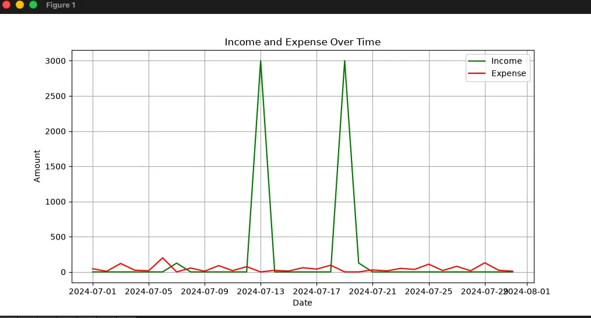

# Personal Finance Tracker

A lightweight command-line tool for tracking personal income and expenses. Log transactions to a local CSV file, filter and summarize them by date range, and visualize spending trends over time.

## Features

- **Add transactions** — record income or expenses with a date, amount, category, and description
- **View transactions** — filter by date range and see a formatted summary table
- **Financial summaries** — automatic totals for income, expenses, and net savings over any period
- **Visualization** — plot income vs. expenses over time with `matplotlib`

## Example Output

Running a date-range query with plotting enabled generates a chart like this:



## Getting Started

### Prerequisites

- Python 3.10+
- `pandas`
- `matplotlib`

### Installation

```bash
git clone https://github.com/YOUR_USERNAME/personal-finance-tracker.git
cd personal-finance-tracker
python3 -m venv .venv
source .venv/bin/activate
pip install pandas matplotlib
```

### Usage

Run the app:

```bash
python main.py
```

You'll be presented with a simple menu:

```
1. Add a new transaction
2. View transactions
3. Exit
```

- **Add a transaction** — enter a date (or press Enter for today), an amount, a category (`Income` or `Expense`), and a description.
- **View transactions** — enter a start and end date to see matching transactions, a summary of totals, and an optional plot of income vs. expenses over that period.

## Project Structure

```
PersonalFinance/
├── main.py          # Core application logic (CSV handling, summaries, plotting)
├── data_entry.py     # Input validation helpers (date, amount, category, description)
├── finance_data.csv  # Local transaction data (created automatically, not tracked in git)
└── README.md
```

## Data Storage

Transactions are stored locally in `finance_data.csv` with the following columns:

| Column      | Description                          |
|-------------|---------------------------------------|
| date        | Transaction date (DD-MM-YYYY)         |
| amount      | Transaction amount                    |
| category    | `Income` or `Expense`                 |
| description | Free-text note about the transaction  |

This file is excluded from version control via `.gitignore` to keep personal financial data private.

## Roadmap

Some ideas for future improvements:

- [ ] Support for custom categories beyond Income/Expense
- [ ] Monthly and yearly aggregate views
- [ ] Export summaries to PDF or Excel
- [ ] Budget goals and alerts

## License

This project is open source and available under the [MIT License](LICENSE).
